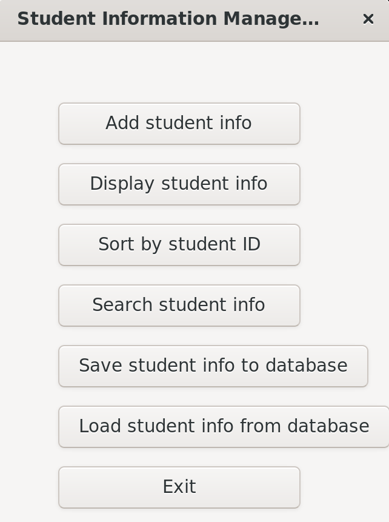
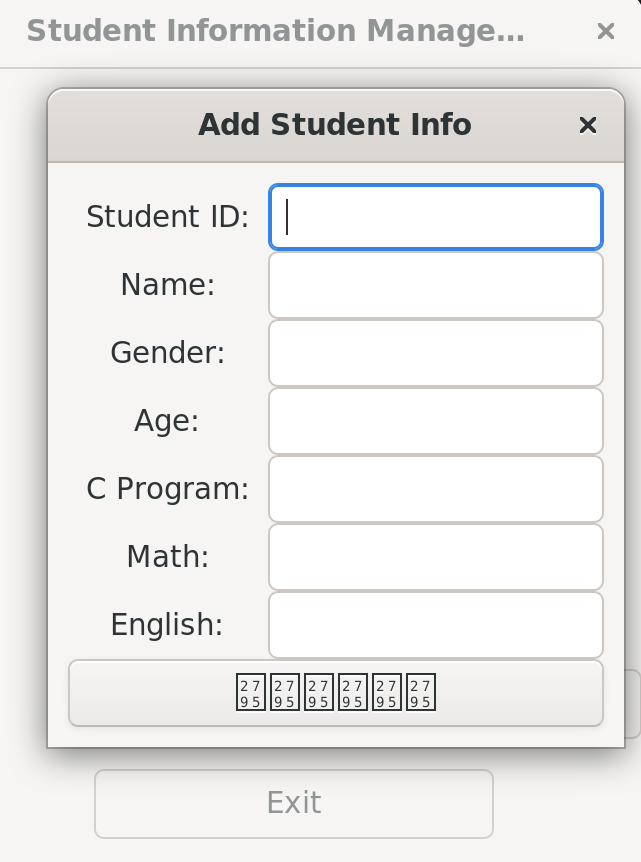
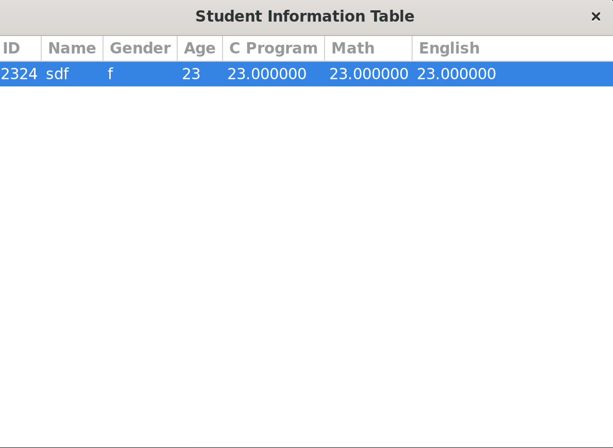

# 学生信息管理系统

## 简介
本项目致力于完成课程作业内容......放着玩的，看个乐就行啊（请忽视🐟🐟）......

## 项目结构

```
|-- StuManagement
    |-- build(👋)
        |-- ......
    |-- header
        |-- global.h
            |-- struct Student
        |-- stu_file.h
            |-- saveStuInfo()
            |-- loadStuInfo()
        |-- stu_service.h
            |-- addStuInfo()
            |-- displayStuInfo()
            |-- Swap()
            |-- sortStuInfo()
            |-- searchStuInfo()
        |-- show_ui.h
            |-- showStuInf()
            |-- addOnClick()
            |-- showAddWindow()
            |-- screarchOnclick()
            |-- showSearchWindow()
    |-- source
        |-- main.c
        |-- stu_file.c
        |-- stu_service.c
    |-- README.md
    |-- CMakeLists.txt
```

## 环境配置（可忽视）
仅linux
```
sudo apt-get update && sudo apt-get upgrade
sudo apt-get install libgtk-3-dev
sudo apt-get install libsqlite3-dev
```
  
## 编译运行


### cmake
``` bash
mkdir ./build ; cd ./build
cmake ..
make
./main
```
## 简单预览


